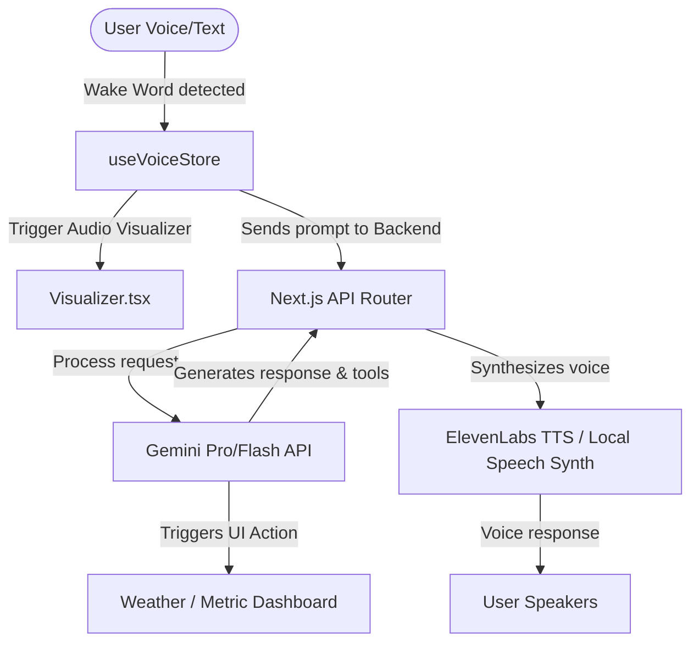

# Z-AI (J.A.R.V.I.S) — HUD Assistant Project Plan & Progress Report

This document serves as a complete blueprint and progress report of the Z-AI JARVIS HUD Assistant. It is structured pointwise so that both **humans** (project stakeholders, developers) and **AIs** (code generators, autonomous agents) can instantly understand the system state, what has been done, and the next steps.

---

## 🌌 Project Overview
**Z-AI (JARVIS)** is a high-fidelity, cross-platform immersive virtual assistant designed for Web/Desktop and Android. The system features a futuristic holographic UI, real-time voice activation, visual metrics, secure facial recognition, and native execution workflows.

---

## 🛠️ What We Have Done (Point-wise Progress)

### 1. Dual-Platform Architecture
We established a codebase supporting two main platforms:
*   **Web & Desktop Core (`z_ai_web_hud`)**:
    *   Powered by **React (v19)**, **Next.js (v15)**, and **Tailwind CSS (v4)**.
    *   Pre-configured with **Capacitor (`@capacitor/android`)** to allow compiling the Next.js app as a native Android package.
*   **Native Mobile Core (`z_ai_rn_app`)**:
    *   A native mobile dashboard powered by **React Native**, **Expo**, and **TypeScript**.
    *   Built to run standalone on Android and iOS devices.

---

### 2. Holographic UI Screens (The Four Pillars)
We created a 4-screen layout system matching futuristic Sci-Fi UI states, implemented consistently across both the Next.js Web app and React Native Mobile app:

*   **🔒 Security Lock Screen (Biometric Scan)**:
    *   *Concept:* Entry portal for the app requiring authorization.
    *   *Web Implementation:* Binds to the device camera using `face-api.js` for actual webcam-based facial recognition. Access is locked until a human face is recognized.
    *   *Mobile Implementation:* Displays a simulated biometric scan ring with a glassmorphism password override.
*   **🛸 Main HUD (Active Core)**:
    *   *Concept:* The core cockpit of the JARVIS assistant.
    *   *Web/Mobile:* A large **3-Ring SVG Hologram** in the center that rotates, glows, and changes colors based on voice state (Listening/Thinking/Speaking/Idle).
    *   *Details:* Surrounded by altitude meters (ALT), telemetry displays, system log terminals, and connection toggles.
*   **⚙️ Application & Permission Control Dashboard**:
    *   *Concept:* Safe control console for external app access.
    *   *Components:* Authorizes connections to apps like WhatsApp or VS Code, displays manual shell script execution triggers, and includes a global security lock override.
*   **📶 Network Failure & Offline Mode State**:
    *   *Concept:* Self-healing HUD fallback UI.
    *   *Behavior:* The visual center turns orange/red, HUD logs change to warning states, and speech synthesis shifts automatically to local browser voice generation (offline TTS).

---

### 3. Web & Desktop Features (`z_ai_web_hud`)
The Next.js core application is fully operational and has implemented premium features:
*   **👁️ Face Detection Authex (`useSecureFaceAuth.ts`)**:
    *   Uses a lightweight neural network from `face-api.js` to scan the user's face in the webcam feed.
    *   Only unlocks the HUD when a face is verified.
*   **📊 Holographic Audio Visualizer (`Visualizer.tsx`)**:
    *   An HTML Canvas-based visualizer running a glowing frequency waveform.
    *   Utilizes the **Web Audio API** to dynamically react to mic input when you talk, and speaker output when Z-AI replies.
*   **🔋 Real Device Telemetry**:
    *   Hooks into native browser APIs (`navigator.getBattery()`, `navigator.connection`).
    *   Lets Z-AI answer battery-level and internet speed questions with real-time hardware data.
*   **🌦️ Glassmorphism Weather Widget (`WeatherWidget.tsx`)**:
    *   A custom interactive overlay that gets spawned instantly on the HUD when Z-AI queries current weather.
*   **🧠 Contextual Memory Loop (`useVoiceInterface.ts`)**:
    *   Keeps an active array of the last 5 turns of conversations, providing Z-AI with short-term context awareness.

---

### 4. Code & Directory Structure (For AIs and Humans)

#### 📂 Workspace Root Directory
```text
stitch_z_ai_jarvis_hud_assistant/
├── z_ai_web_hud/               <-- Next.js Web App + Capacitor Android Core
│   ├── src/
│   │   ├── app/                <-- Pages, Layout, and API routes (/api/chat, /api/tts)
│   │   ├── components/         <-- UI Parts (WeatherWidget.tsx, Visualizer.tsx)
│   │   │   └── hud/            <-- JarvisHUD.tsx (Core Web HUD Component)
│   │   ├── hooks/              <-- useSecureFaceAuth.ts, useVoiceInterface.ts
│   │   ├── store/              <-- useVoiceStore.ts, useAssistantStore.ts (Zustand Stores)
│   │   └── utils/
│   └── package.json            <-- Dependency configuration (Next, face-api, tailwind v4)
│
├── z_ai_rn_app/                <-- React Native Mobile App (Expo & TypeScript)
│   ├── src/
│   │   ├── screens/            <-- Four mirror screens (Security, Main, Permissions, Offline)
│   │   ├── components/         <-- Custom native assets and visual meters
│   │   ├── store/              <-- React Native state machines
│   │   └── navigation/         <-- Nav systems between lockscreen and main HUD
│   └── App.tsx                 <-- React Native entry file
│
├── [Static UI Folders]         <-- Reference layouts with static 'code.html' & 'screen.png' mocks
│   ├── main_hud_active/
│   ├── offline_state_hud/
│   ├── permission_dashboard/
│   ├── security_lock_screen/
│   ├── zayd_desktop_hud_main/
│   ├── zayd_desktop_offline_hud/
│   ├── zayd_desktop_permissions/
│   └── zayd_desktop_security_lock/
│
└── aether_hud/                 <-- Aether HUD specifications (DESIGN.md)
```

---

## 🔄 Execution & Communication Flows



---

## 🔮 Next Phase / Roadmap
Based on current progress and historical planning (`implementation_plan.md.resolved`):

1.  **Phase 4 Automation Daemon (Desktop Sidecar)**:
    *   Build a lightweight background daemon (Go/Node.js) on the local host.
    *   Create a WebSocket connection between the Next.js HUD (`z_ai_web_hud`) and `localhost:8080` to allow execution of local bash, command terminal actions, and file creation.
2.  **Mobile Capacitor Integration**:
    *   Compile the `z_ai_web_hud` Next.js code directly into the Capacitor native project framework inside `z_ai_web_hud/android`.
    *   Verify the native bridge interface (e.g., using `@capacitor/filesystem` for file actions and mobile permissions).
3.  **Human-in-the-Loop Security (HITL)**:
    *   Build an interactive consent prompt on the HUD whenever Z-AI initiates a local command script execution.
